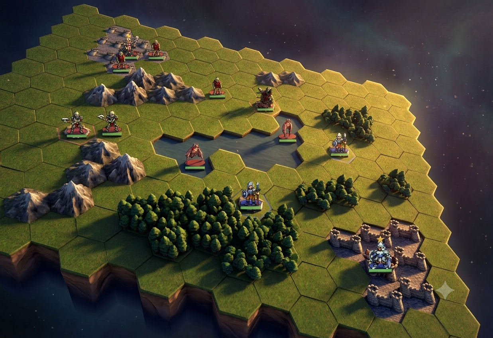
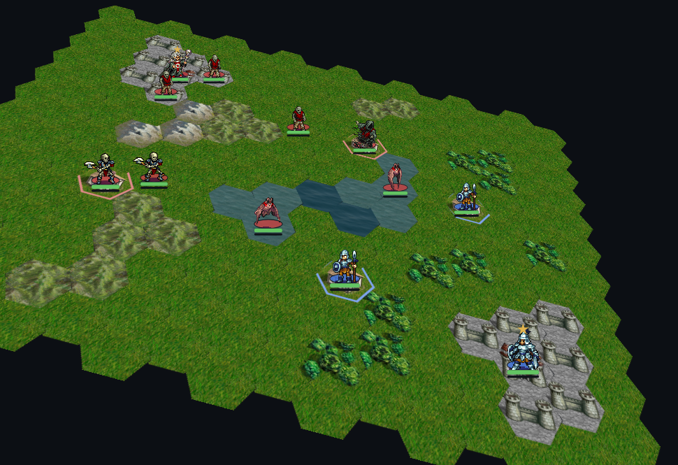
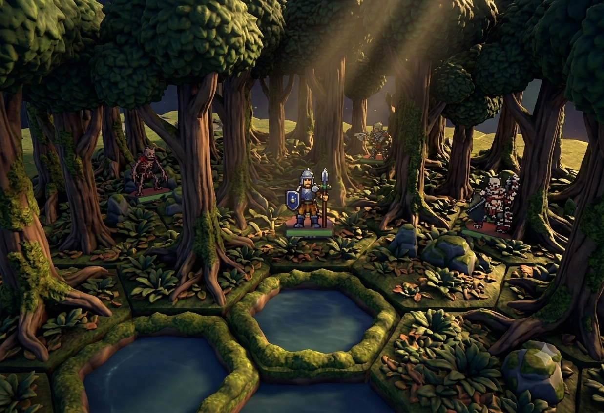

# 盤面ビジュアルの設計指針: ジオラマ方向(Gemini提案デザイン)

最終更新: 2026-07-06

盤面の傾き(3D風)表示を本番導入した際、nano banana(Gemini)に見た目の方向性を
提案させたところ、「Wesnothの平面タイルを傾ける」のではなく**立体感を強調した
レイアウト・タイルセットに寄せる**方が合っているという評価になった。
本ドキュメントはその提案デザインを設計指針として記録するもの。

| リファレンス | 現状(導入直後) |
|---|---|
|  |  |

## 方向性の判断

- Wesnothの平面タイル(+CSS傾け)でも立体感は思ったより保たれるが、この延長で
  「継ぎ目の自然なブレンド」を目指すと本家の自動タイリング移植という重い道になる
- 逆に**ジオラマ(卓上模型)の文法**に振り切ると、ヘックスとユニット配置の構造は
  そのままに、タイルアートの差し替えだけで別物の見た目になる
- 独自タイルセット(AI生成)への移行は**WesnothアセットのGPL問題からの出口**でもある
  (sprite_guide.md「ライセンス」参照。ユニットスプライトは当面Wesnoth継続でよい)

## リファレンスの立体感を作っている要素(分解)

1. **ヘックスの厚み** — タイルが押し出されたプリズムで、手前側に土の側面が見える。
   特に盤面外周がジオラマの台座のように切り立っている
2. **地形の高さ差** — 山・森が盛り上がり、水面が凹んでいる(上面だけでなく体積がある)
3. **一貫した光源** — 全タイルが同一方向からのライティングで描かれ、影が落ちる
4. ヘックスグリッド・ユニット配置の構造は現状と同じ(タイルアートの文法だけが違う)

## 実装アーキテクチャとの関係

現在の地形は「CSS 3D transformで傾けた平面」(TiltStage)なので、平面である限り
厚み・高さは出ない。ここが本質的な分岐点。ただし土台は実装済み:

- 投影計算(lib/tilt.ts projectTilt)・ビルボード描画・奥→手前の描画順は
  ユニット側で稼働中
- 地形を「CSS傾け平面」から「**ユニットと同じビルボード方式**(タイル画像を投影位置に
  奥から敷く)」に切り替えれば、地形ごとの高さオフセット(山+8px、水-4px等)と
  側面スカートが可能になる
- **クリック判定は透明なCSS傾け平面をそのまま残す**(描画と判定の分離。既存の
  ヒットテストを壊さない)

## 段階的な進め方

- **Phase A(安い先行実験)**: 盤面外周の「台座の縁」(外周ヘックス手前側の暗い側面
  ポリゴン)+ユニットの足元影。現構造のままジオラマ感の当たりを見る
- **Phase B(本命)**: 地形のビルボード化+高さオフセット+タイルセット仕様の確定。
  AI生成タイルセットに差し替え(lib/content/のTERRAIN_SPRITES差し替えで済む構造は
  リファクタリング済み)
- **Phase C(磨き)**: 水面アニメ、環境光、縁のブレンド

## 難所:「森の中」の表現と、その解

森が立体の木群になると「森ヘックスに立つユニットをどう見せるか」が問題になる。
解は**深度ソートによる本物の遮蔽**(+可読性フェード):

- 木の群生をタイル上面に焼き込まず、**独立したオブジェクトとしてユニットと同じ
  深度ソートに参加**させる
  - 奥側の木 → ユニットより先に描画(背後に立つ)
  - 手前側の木 → ユニットより後に描画(足元・下半身を隠す)
- 可読性のため、**占有ヘックスの手前の木だけ60〜70%透過**にする
- ゲーム的にも森=伏兵の地形なので「森に入ると半分隠れる」見た目はルールの
  フレーバーと噛み合う

## タイルセットの発注規約(AI生成時の必須仕様)

この設計が成立するかは素材の作り方で決まる。焼き込み一枚絵にすると遮蔽の手が
使えなくなるため、以下を発注規約とする:

1. **「地面レイヤー」と「立体物レイヤー」を分離**して生成する
   - 森 = ヘックス上面(下草付きの地面)+ 木の群生スプライト(透過背景)
   - 山 = 地面 + 岩塊スプライト / 村 = 地面 + 家屋スプライト(同様に一般化)
2. 立体物は**2〜3バリアント**(全ヘックス同じ絵になる単調さの回避)
3. **光源方向を全素材で固定**して一括生成(ライティングの一貫性が立体感の生命線)
4. ヘックス上面は72pxヘックス(フラットトップ)に合わせる。側面スカートは
   高さ表現導入時に上面とセットで生成する

## 戦闘カットイン(第2のリファレンス)

盤面のジオラマ化とは別軸で、**戦闘シーンをカットイン演出として大写しにする**方向。
スマホでは盤面上の72pxユニットで演出を堪能できないため、盤面=操作、カットイン=演出と
役割分担する(ファイアーエムブレム型)。こちらの方がスマホ向きという評価。

- **ドット絵スプライトを拡大して立体背景に置いても成立する**ことをリファレンスが実証
  している(ビルボード方式の美学的な裏付け)。ユニット素材はWesnothドット絵のままでよい
- 実装は combatTimeline(レンダラー非依存の再生データ)の**もう一つのレンダラー**として
  書ける。/dev/sprites のCombatDemoが実質のプロトタイプ
- 背景は「防御側ヘックスの地形」に応じた一枚絵(森・草原・水辺・城など数枚をAI生成)。
  ヘックスの構造を背景に残すと盤面との連続性が出る
- 非同期PvPの演出方針(architecture.md)と整合: 自分の攻撃とCPU戦でのみ再生、
  スキップ可能にする。相手ターンの後追い確認では再生しない

### カットインは平面を既定とする(2026-07-06 プレイ評価で決定)

骨格実装(CutInStage)で平面版と傾き(3D風)版の両方を作って実戦で比較した結果、
**盤面=傾き(ジオラマ)、カットイン=平面(舞台の寄り)** の使い分けに決定。
傾きトグルは当面評価用に残すが、既定は平面。理由は構造的:

1. **傾きの価値は「広さ」から生まれる** — 奥行き方向に何列も続く盤面でこそ
   密度圧縮・遠近感が効く。幅4hexの小さな舞台には圧縮すべき奥行きがなく、
   歪みのコストだけ払って対価がない(「深い」ではなく「曲がってる」に見える)
2. **カットインの仕事は「読むこと」** — 誰が当てて残りHPがどうなったかを2秒で
   確認する画面。読む作業には正射影が向き、遠近の歪みは認知負荷になる
3. **額縁との不整合** — 長方形パネルの中の傾いた地面は「斜めに撮れた写真」に見える。
   全画面で枠のない盤面では傾き=カメラアングルとして自然に読めるのと対照的
4. **スプライトに遠近が焼き込み済み** — Wesnothドット絵は3/4視点で描かれており、
   拡大表示では絵の中の遠近が強く出る。地面の幾何学的な傾きを重ねると二重掛けになる

副次効果として、視覚レジスターが2つに分かれるので「カットインが開いた」こと自体が
認識しやすくなる。

**ジャンルの前例**(この使い分けは35年来のSRPGの伝統に沿っている):
- 平面カットイン派: ファイアーエムブレム(GBA期)、スーパーロボット大戦、
  Advance Wars、Heroes of Might & Magic(戦闘=平面ヘックス闘技場。構造が最も近い古典)、
  ユニコーンオーバーロード(2024。俯瞰マップ+平面舞台+地形背景でほぼ同型)
- カットインなし派: Wesnoth本家・Civilization — 大画面PC前提では72pxでも読めるため。
  うちがカットインを入れる動機(スマホの小画面)と裏表
- 3D戦闘シーン派: FEの3DS以降・Total War — フル3Dエンジン前提の選択。
  2Dスプライトのゲームで戦闘シーンだけ疑似3Dにした例はほぼない
  (=平面が正解という上記の分析が、ジャンル全体の収束として観測できる)

**アーキテクチャ上の特色**: 多くのゲームは戦闘シーンを別のシーン実装として作るが、
うちは同じcombatTimeline(再生データ)を盤面内アニメとカットインの2レンダラーが
購読するだけなので、両者の内容が構造的に食い違えない(「1つのタイムライン、
複数のレンダラー」)。

## アートディレクション: 「サバゲーフィールドのミニチュア」(2026-07-07)

草原+森(低木の茂み)の自作素材が入った時点で見えた方向性。この盤面は
「自然の風景のジオラマ」ではなく**「プレイのために設計されたフィールドの
ミニチュア」**として作る:

- 均質な芝(ゴルフ場のラフ)+低い茂みのバンカー+台座 = 競技場の空気感
- サバゲーフィールドは「遮蔽物の機能が一目で分かるよう設計された地形」であり、
  Wesnoth系の「地形=防御ボーナス」と同型。**見た目がルールを説明する**
- 以降の地形はこの基準で発注する: 丘=整形された土塁マウンド、
  山=大型の造形物、村=フィールド上の構造物。自然主義に寄せない。
  ※「幾何学的」はコンセプト語であって**生成プロンプトには使わない**
  (板チョコ化する。語彙の教訓は skill の大原則5参照)
- 立体物は「低く・輪郭が明瞭・機能が読める」を優先(高い木で視界を塞がない)
- **基本タイルセット方針(2026-07-08)**: 各地形の「基本の絵」を1つに決める
  (森=groves樹冠/丘=hills-c/浅瀬=a/深海=a/陣地・フラッグ=castle-a/村=テント1張)。
  バリアント(派生系)は画面を見づらくするため既定では使わず、追加効果や
  周辺地形との組み合わせ(森の内側/端等)として意図を持って導入する。
  未使用アセットは public/terrain-diorama/ に温存
- **縁ロジック本番昇格(2026-07-08 夜)**: 森は文脈で絵が変わる —
  境界(森と非森に接する)=小塊2体が同地形の隣の重心へ自動で片寄せ(clusterPull)、
  内側・孤立=密な樹冠1体(孤立ヘックスでも「森なのか平地なのか」が一目)。
  受け皿は汎用(TerrainSpriteDef.interiorObjects + TerrainObjectDef.clusterPull。
  選択規則は lib/board/objects.ts pickTerrainObjects)なので、
  丘・砂地の派生も同じ仕組みで文脈適用できる。
  派生をマップ作者が選ぶ場合は「兄弟地形IDへの昇格」(砂地/砂漠が前例)を使う
- **地面タイルの文脈選択(2026-07-08 ユーザー指定アルゴリズム)**:
  lib/content/groundRules.ts の contextualGround がクラスタの形からタイルを選ぶ
  (立体物の縁ロジックの地面版)。丘の規則: 右斜め一列=h(高地プレート)/
  左斜め一列=g(NE端)-i(中間)-a(SW端)の尾根 / 二列以上・縦列・分岐・孤立=c。
  浅瀬の規則: 広い浅瀬の砂丘に接する縁=water-shallow-b(砂浜に寄せる波)、それ以外=a
  (方位対応の岸辺coastは2026-07-08に一度試して挙動不良のため撤回・温存。仕切り直し予定)。
  砂地はa/bの2種構成(cは色味不整合で温存へ降格)
- **山=地上侵入不可の壁(2026-07-08 決定)**: 山は walk/swim 不可・fly のみ通行
  (深水の陸版。移動モデル3種の範囲内で実現、能力単純化方針と整合)。見た目も
  森と同じ objects 方式で岩塊の立体物を立て、「入れない」ことが一目で分かる
  高さと硬い輪郭にする(発注書: assets-pipeline/orders/mountains-massif.json)
- **フィクションパス(2026-07-07 決定)**: 構造物系地形と通貨の皮を世界観に合わせる。
  **村 → 補給拠点**(補給テント・弾薬箱・旗ポール。占領の旗表示=フラッグ戦の意味を持つ)、
  **ゴールド → 物資**(確保拠点が多い=補給ラインが太い=物資収入増。雇用=増援の投入、
  維持費=前線部隊の消耗、と現行ルールの説明として自然になる)。
  エンジンのID・ルール・テストは無傷で、表示名・文言・絵のみ差し替える。
  城→**陣地**・主城→**フラッグ**で確定(2026-07-07)。フラッグ=旗が立つだけの象徴地点、陣地=増援の展開区画。※「フラッグを取れば勝利」ではない(勝利=リーダー撃破)ことをチュートリアルで明示する
- 同一地形内での自然物/人工物の混在は歓迎(2026-07-07 丘で確認: b/d=自然の丘、
  c=砂を沈めたらトーチカ的な人工丘になった。実際のフィールドも自然の起伏と
  人工バンカーが混ざるので世界観に合う。バリアントの表現幅として活用する)
- **視点間の整合より各視点内の一貫性(2026-07-08 原則化)**: 立体物のオフセットは
  ビュー空間で適用され(HexGrid参照)、タイルの焼き込み光源も固定のため、
  両プレイヤーが見る盤面は物理的には同一のジオラマではない。これは意図的な設計:
  誰も両視点を同時には見られないので、各画面が一貫していれば違和感は生じない
  (実物のミニチュアも照明は固定。アイソメ系ゲーム共通の規約)。丘の陰影が
  反対視点で「段差の向こう面の陰」に読めるのは無料の立体演出。ゲームの対称性は
  論理座標(hex.ts)が担保しており、演出の非対称はプレイに影響しない。
  ※「視点で物の位置が変わるのはバグでは」と誤修正しないこと
- 副産物の観察(2026-07-07): 立体物の導入で斜め表示と平面表示の性格が分離した。
  斜め=フィールド(遮蔽・遠近・台座が効く臨場感)、平面=作戦図(歪みなく距離・
  陣形が読める)。将来「作戦図モード切替」というUIの芽になりうる

## 関連

- 傾き表示の実装: lib/tilt.ts / TiltStage.tsx / HexGridの2層構造(architecture.md)
- 地形のレイヤー描画(森=草原+木の2層)は導入済み。ジオラマ化はこの延長
- ビュー変換(青視点は盤面180度回転)は視点の設計として独立(この指針と直交)
